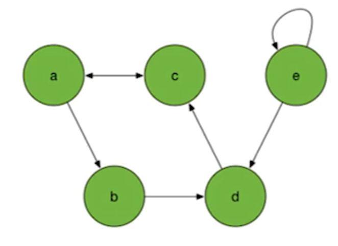
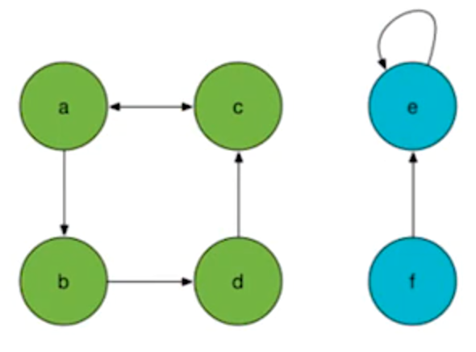
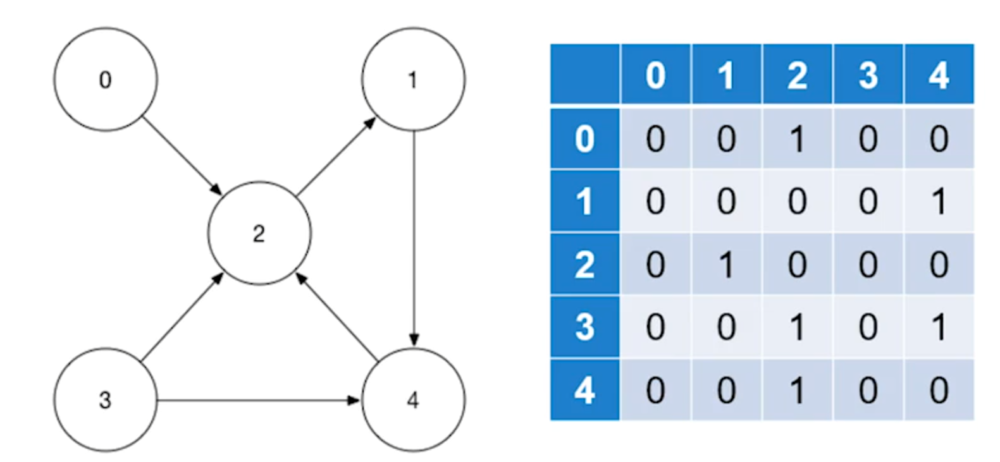
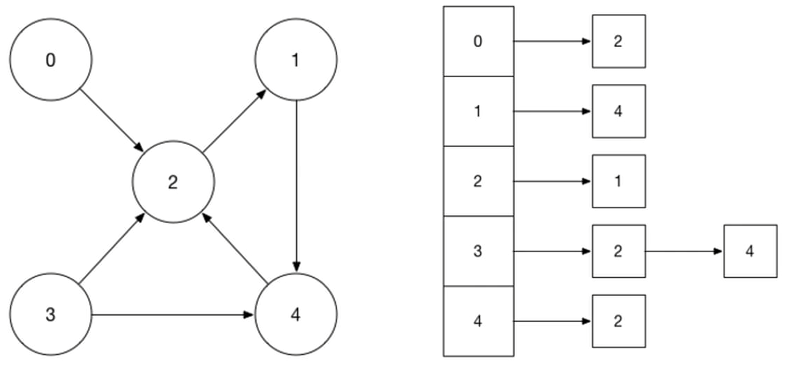

# Week 10 Graphs
- [Home](/README.md#cps-500-programming-and-data-structures)
- [10.1 Introduction to Graphs](#101-Introduction-To-Graphs)
- [10.2 Graph Representations](#102-graph-representations)
- [10.3 Graph Traversals](#103-graph-traversals)


## 10.1 Introduction to Graphs
[top](#week-10-graphs)

### Graphs

- Graphs are a mathematical construct that are widely used in every day computer science.
- They model:
  - Social networks
  - computer communications
  - protein interactoin networks
  - route planning
  - goal planning
- They are common strudied in mathematics under graph theory (some overlap here)

### Graph Definitions
- A graph has two components:
  1. **vertex set** (entities, people, computers, events)
  2. **edges** (interactions between vertices) - take the form of (v<sub>1</sub>, v<sub>2</sub>), where v<sub>1</sub> and v<sub>2</sub> are verices
    - v1 and v2 called **neighbors/adjacent** when an edge exists between them
- A **directed graph** is one in which edges have a direction.
- An **undirected graph**  is one in which edges have no direction so (v<sub>1</sub>,v<sub>2</sub>) automatically implies (v<sub>2</sub>,v<sub>1</sub>) 

- A **weighted graph** is one in which edges have a real number weight associated with them.
  - weights can represent cost, distance, capacity, and so on.

### Graph Terms
- **path** a series of vertices such that they are pairwise connected by edges
  - {e,d,c,a} is a path on the right
  - {b,e,d} is not a path on the right
  
- **cycle** a path that returns to its starting node.
  - {a,b,d,c,a} is a cycle
- node e has a **reflexive** edge

### More Definitions
- **subgraph** a subset of the vertices (and their associated edges)
  - considered a valid graph in its own right
- All edges do not have to be connected for a graph to be valid
  - in particular, a graph can be divided into one or more **connected components**
  - there can be a single graph with vertices {a,b,c,d,e,f} and two connected components {a,b,c,d} and {e,f}
  

## 10.2 Graph Representations
[top](#week-10-graphs)

### Two main data representations
1. Adjacency matrix
2. Adjacency list

### Adjacency Matrix
- all nodes are assigned an ID between [0:N-1]
- we create the NxN matric (double array)
  - the value in matrix[i,j]=1 if there is an edge from i to j, 0 otherwise
  - alternatively, we can store a real number indicating the weight of the edge between i and j
    - with 0 or infinity representing no edge
### Example
  
- notice that memory usage is O(N<sup>2</sup>)
- a **sparse** graph is mostly 0s
- A **dense** graph  is mostly 1s

### Performance
- most real-world graph are **sparse**, so they wast too much memory: O(N<sup>2</sup>)
- checking if an edge exists from i to j is O(1)
- to iterate over all edges of node i takes O(N)
- looking up the incoming edges for edge i takes O(N)
- certain graph calculations are easiest in the form of matrix calculations

### Adjacency Lists
- an alternative representation for graphs uses **adjacency lits**
- adjacency lists use an array of lists
- the index into the array matches the node's ID
- the list at index *i* is the set of nodes that has an edge **to**.

### Adjacency List Implementation
```C
typedef struct Edge{
    int dest;
    struct Edge*next;
} Edge;
typedef struct Graph{
    int N;
    struct Edge** adj_ist;
}
```

### Adjacency List Example


### Performance
- Adjacency lists use O(|N|+|E|) memory and still has memory overhead as O(|E|) for pointers in lists.
- Checking if an edge exists from i to j is O(degree(i)), typically less than N.
- To iterate over all edges of node *i* takes O(degree(i)).
- looking up incoming edges takes O(|E|)

### Which to Use?
- It depends on the problem and the graph
- Large graphs may be too large/slow to use the adjacency matrix.
- Dense graphs might be worth the trade-off for adjacency matrix.
- It depends on the problem - iterate over all edges? Do you need to do matrix calculations over a graph?

## 10.3 Graph Traversals
[top](#week-10-graphs)

- Revisit BFS and DFS on graphs
- Notice that a tree is a type of graph (directed-acyclic)
- How might the algorithm change?

### Depth-First seach
- Recall that a depth-first search alogorithm vists children nodes before it visits sibling nodes.
1. Choose an arbitrary node as a starting point i
2. See the i into a stack of vertices to explore
3. Remove i from the stack
  1. Process(i)
  2. Mark i as explored
4. Iterate over its neighbors, j(out-edges)
5. Check if j has already been explored or discovered
6. If not:
  1. Add j to the stack
  2. Mark it as explored
7. Repeat steps 3-6